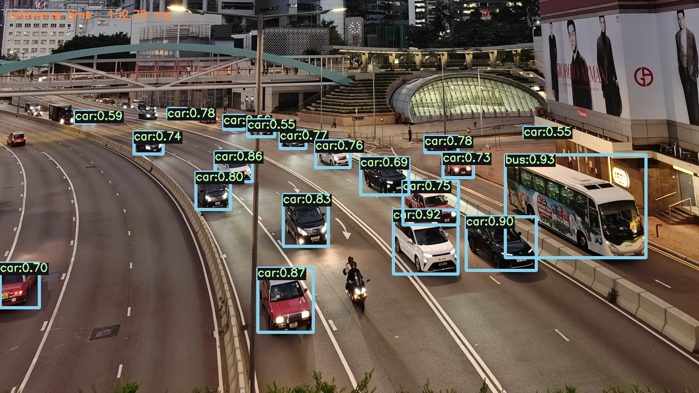

# yolov5-cpp

A object detection system built with C++ and OpenCV, leveraging the YOLOv5 (You Only Look Once) deep learning architecture for fast and accurate object detection.




## 🚀 Features

1. **Multiple Detection Modes**:
   - Single image detection
   - Batch processing for image directories
   - Video file processing
   - Real-time camera detection
2. **Performance**:
   - Optimized for real-time detection using YOLOv5 ONNX model
   - Performance tracking with inference time measurement
   - FPS monitoring for video and camera modes
3. **Visualization**:
   - Bounding box drawing with class labels
   - Confidence score display
   - Custom color scheme for enhanced visibility

## Requirements

- C++17 compatible compiler
- OpenCV 4.x with DNN module
- CMake 3.10+

## YOLOv5 Model conversion

```sh
# Clone YOLOv5 repository
git clone https://github.com/ultralytics/yolov5.git

cd yolov5

# Download the model weight file, here take yolov5s.pt as example
wget https://github.com/ultralytics/yolov5/releases/download/v7.0/yolov5s.pt

# Convert yolov5s.pt to yolov5s.onxx
python export.py --weights yolov5s.pt --include onnx
```

## 🖥️ Installation

1. Clone the Repository

```sh
git clone https://github.com/jiafie7/yolov5-cpp.git
cd yolov5-cpp
```

2. Build the project

```sh
mkdir build && cd build
cmake ..
make
```

3. Usage

```sh
# Single image mode
./main --image path/to/image.jpg

# Batch process mode
./main --batch path/to/input/directory path/to/output/directory

# Video process mode
./main --video path/to/a.mp4 path/to/b.mp4

# Camera real-time detection without saving
./main --camera

# Camera real-time detection with saving
./main --camera path/to/output.mp4
```

## Customization

The system supports different YOLO models in ONNX format. You can use YOLOv5n, YOLOv5s, YOLOv5m, YOLOv5l, YOLOv5x or any other YOLO variant by changing the model path in the constructor:

```c
YOLODetector detector("path/to/your/model.onnx", "path/to/classes.txt");
```

## Performance Optimization

For better performance, consider:

1. Using smaller models (YOLOv5n or YOLOv5s) for real-time applications
2. Reducing input resolution
3. Compiling OpenCV with CUDA support for GPU acceleration
4. Adjusting confidence and NMS thresholds based on your use case

## License

This project is licensed under the MIT License. See the LICENSE file for more information.

## Contributing

Contributions, bug reports, and feature requests are welcome. Feel free to fork the repository, open issues, or submit pull requests.

## Acknowledgments

- YOLOv5 by Ultralytics
- OpenCV community
